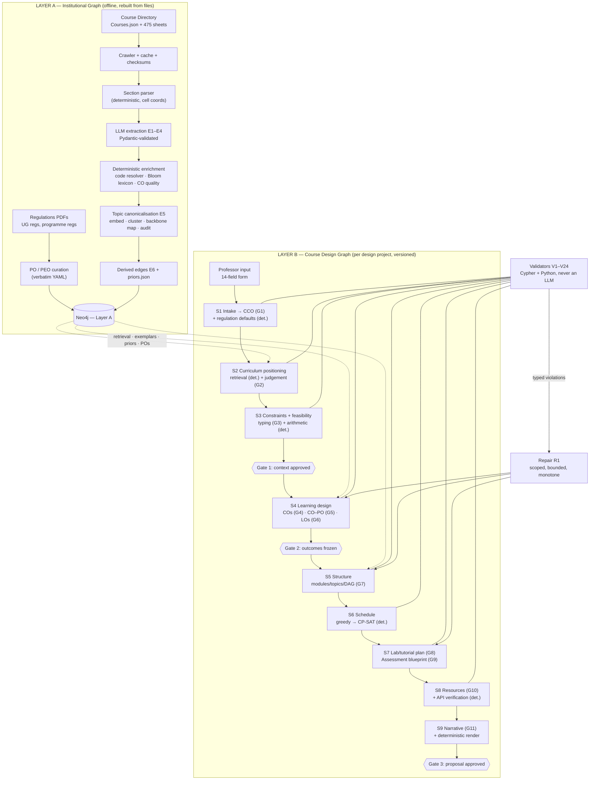

# ProfsAgent — Stage 1 Architecture
### Institutional KG → New-Course Design Graph → Outcome structure (PEO/PO/CO/LO) → Gem-equivalent proposal, done properly

Status: **DRAFT v0.1 — for team argument, not frozen.**
Scope: pipeline stages 1–3 (context, grounding, constraint analysis) plus the Learning-Design, Structuring,
Scheduling and Assessment-*blueprint* steps. That is everything needed to emit what the Gem emitted
(COs, prerequisites, weekly lecture plan, lab plan, assessment plan, resources, CO–PO matrix), except that
every item here is a graph node with an ID, a source and a validator.
Out of scope for Stage 1: teaching materials (slides/notes), question items, rubrics, grading optimisation.
The schema already has slots for them, so adding them later doesn't need a migration.

---

## 0. Findings that shape the design

These were checked on 2026-09-30. Everything else in this document is a proposal.

| # | Fact | Source |
|---|---|---|
| F1 | The IIIT-D Course Directory is backed by a public JSON file: `https://techtree.iiitd.edu.in/static/Courses.json`. It has **475 rows** with code, name, credits, prerequisites, preferable prerequisites, anti-requisites, semester, professor, cluster and an `embed_link`. | fetched |
| F2 | Each row's `embed_link` is a **published Google Sheet**. The sheet exports cleanly with `…/pub?output=csv` (also `output=xlsx`). | fetched: CSE201, CSE231, CSE594A, CSE701 |
| F3 | The sheets follow **IIIT-D's own course-proposal form**: Code, Name, Credits, Offered to, Description, Pre-requisites (Mandatory / Desirable / Other), **Post Conditions** (CO1…COn), Weekly Lecture Plan (Week, Lecture Topic, **COs Met**, Tutorial, Assignments/Project), Weekly Lab Plan, Assessment Plan (Type, % contribution), Resource Material (Type, Title). | fetched |
| F4 | There are at least **two template generations**. The newer one adds Department, "counted towards" fields and a Weekly Lab Plan section. Layouts drift: prerequisites appear sometimes in rows and sometimes in columns, and some sheets have typos like "C04". | fetched |
| F5 | **Corpus CO quality is uneven.** Examples: "To get familiar with the concept of…" (CSE594A), "Familiarity about how AI is being used…" (CSE701). The corpus is excellent for structure, topics and prerequisites, but COs must be quality-scored before any are used as exemplars. | fetched |
| F6 | The corpus has **no LOs and no CO–PO mappings**. Both are ours to create, and any corpus-side CO→PO link is *inferred* and must be tagged as such. | fetched |
| F7 | Level distribution by primary code: 1xx 18, 2xx 72, 3xx 91, 4xx 15, 5xx 213, 6xx 52, 7xx 9. **84 rows are cross-listed** (e.g. `AI501 / ECE363 / ECE563 / CSE343 / CSE543`). Credits: 425 × 4, 49 × 2, 1 × 1. | computed from F1 |
| F8 | UG Regulations (Oct 2025) §2: a semester has **13 weeks of teaching**, a mid-sem recess, a mid-sem exam and an end-sem exam; the last ~10 days are reserved for end-sem, demos and presentations. §4: a **4-credit course = 3 lecture hours/week (~39 h) + 1 hour of interaction/tutorial per week; labs optional**. §6.2: mid-sem and end-sem exams are scheduled per the calendar, and the instructor decides everything else. **No assessment-weight bands appear in the regulations.** | `iiitd.ac.in/…/2025-October-UG Regulations.pdf` |
| F9 | B.Tech CSE Regulations (Aug 2019) list **12 programme objectives** (the POs) and a preamble objective (≈ PEO). | `…/2019-August-BTech(CSE)-Regulations.pdf`, p.1, stored in `data/programmes/btech_cse.yaml` |
| F10 | Directly relevant existing courses that the Gem's overlap check **missed**: CSE701 *Topics in SE: AI in SE*, CSE583 *Software Development using Open Source*, CSE594A *Agentic Reasoning* (2 cr), CSE581 *Systems Analysis, Design and Requirements Engineering*, CSE582 *Software Production Evolution and Maintenance*, CSE503 *Program Analysis*, CSE584 *Program Verification*. | F1 |

**Design consequence:** the data needed for the institutional graph is structured, public and already in IIIT-D's
own vocabulary. The proposal we output should therefore be rendered **in that same form**, so a ProfsAgent
proposal and a real catalogue sheet can be diffed field by field. That is also what makes the gold-set
comparison clean.

---

## 1. Initial things to do (ordered)

Each item has a *done-when* condition. Items 1–4 unblock everything else.

| # | Task | Done when |
|---|---|---|
| 1 | **Repo + environment.** `git init`, Python 3.11+, `uv`, `ruff`, `pytest`. `docker-compose.yml` with Neo4j 5 (APOC + GDS plugins). Keys go in `.env`, which is git-ignored. | `docker compose up` gives a Neo4j that `graph/schema.cypher` applies to cleanly |
| 2 | **Freeze the six decisions in §11** (terminology, LO granularity, PO source, topic backbone, ID scheme, model/provider split). | Decisions recorded in `docs/decisions.md` |
| 3 | **Commit the gold set** in `data/gold_set.txt`: 5–8 course codes. The crawler reads this file and **excludes those sheets' content from every index**. See §4.8 for the stub-node rule. | File committed *before* the first crawl |
| 4 | **Curate POs/PEOs** for each target programme into `data/programmes/*.yaml`, verbatim, with URL and page. B.Tech CSE is done (F9). Next: CSAI, CSAM, CSD, CSB, CSSS, ECE. Check whether a newer CSE regulation supersedes Aug 2019. | Every programme we target has a YAML file with a source |
| 5 | **Crawler.** Fetch `Courses.json`, then every sheet as CSV and XLSX. Cache raw bytes plus `sha256` and `fetched_at` in `data/raw/`. Rate-limit to ~1 req/s. Write a manifest. Get advisor sign-off on scope (it's public and low-volume, but ask anyway). | 475 raw sheets cached. Re-running is a no-op unless the checksum changes |
| 6 | **Deterministic section parser.** Anchor on the form's labels (`Course Code`, `Pre-requisite`, `Post Conditions`, `Weekly Lecture Plan`, `Weekly Lab Plan`, `Assessment Plan`, `Resource Material`) and emit sections with **cell coordinates**. Handle both template generations. | Passes 10 hand-checked fixture sheets in `tests/fixtures/` |
| 7 | **Schema v0** (`graph/schema.cypher` + Pydantic models). Load the 10 fixture courses by hand, find where the schema breaks, fix it, and freeze by end of week 2. | Schema tagged `schema-v1` in git |
| 8 | **Extraction** (prompts E1–E4) over all non-gold sheets. Output is Pydantic-validated JSON per course in `data/extracted/<code>.json`. **These files are the source of truth, and the graph is rebuilt from them.** | ≥ 95% of sheets produce valid JSON. Failures are logged, not skipped silently |
| 9 | **Deterministic enrichers:** course-code resolver (aliases, fuzzy name → code), Bloom verb tagger (lexicon from KB_13 and IIIT-D's verb sheet if we can obtain it), CO quality scorer. | Unit-tested |
| 10 | **Topic canonicalisation** (§4.5, prompt E5), followed by a one-time human audit of 50 clusters. | Audit precision reported |
| 11 | **Derived edges + `priors.json`** (§4.6, §4.7). | Priors file committed and versioned |
| 12 | **Extraction audit:** 20 random courses, field-level precision and recall checked by hand. **Report the number.** | Number in `docs/audit_extraction.md` |
| 13 | **Thin end-to-end run of S1–S9** on one new course, using a greedy scheduler in place of CP-SAT. Use **the same 14-field input as the Gem runs** so the comparison is direct. | Proposal rendered, validators run, diff vs the Gem output written up |
| 14 | Validator suite V1–V24 (§8) as code, then the defect-injection study (see CONTEXT.md, Phase 3). | Detection-recall table |

---

## 2. Architecture overview



Three rules hold everywhere:

1. **The graph is the course; the document is a view of it.** Rendering is deterministic templating from the graph. The Gem's defects hid inside prose. Here there's no prose that isn't backed by a node.
2. **LLMs propose, code disposes.** Every LLM call returns schema-constrained JSON, validators run on it, and only then does it reach the graph. No prompt asks the model whether its own output is correct (C2).
3. **Numbers never come from an LLM.** Weeks, hours, weights, overlap percentages, CO–PO strengths and marks shares are computed or taken from regulations and the professor. The LLM may *propose* weights, but validators and the solver decide.

---

## 3. The source: IIIT-D course sheet → fields we get

| Form section | Fields | Parse method | Graph target |
|---|---|---|---|
| Header | code(s), name, credits, offered to, department, description | deterministic (label→value) | `Course` properties |
| Pre-requisites | mandatory / desirable / other; free text like "CSE101, CSE102", "Machine Learning", "Consent of the instructor" | deterministic split + **E1** for resolution | `REQUIRES {kind}` → `Course`, or `REQUIRES_SKILL` → `Topic` |
| Post Conditions | CO1…COn raw text | deterministic cell read + **E3** analysis | `CourseOutcome` nodes |
| Weekly Lecture Plan | week, lecture topic (bulleted cell), COs met, tutorial, assignments/project | deterministic rows + **E2** atomisation | `WeekPlan`, `Topic`, `MEETS`, events |
| Weekly Lab Plan | week, exercise, COs met, platform | same as above | `LabPlan` rows |
| Assessment Plan | type, % contribution, free-text notes | deterministic + **E4** type canonicalisation | `AssessmentComponent` |
| Resource Material | type, title (often incomplete) | **E4** citation parsing, then API verification | `Resource` |

---

## 4. Layer A — Institutional Knowledge Graph

### 4.1 Node types

| Label | Key (`uid`) | Main properties |
|---|---|---|
| `Institution` | `IIITD` | name |
| `Programme` | `BTECH-CSE` | name, regulation_doc, regulation_version |
| `PEO` | `BTECH-CSE/PEO1` | text, source |
| `PO` | `BTECH-CSE/PO4` | text (verbatim), short_label, source_url, source_page |
| `Course` | `CSE201` (primary code) | aliases[], name, credits, level (1–7), offered_to, department, cluster, semester, description, template_version, is_gold_stub |
| `CourseOutcome` | `CSE201/CO3` | raw_text, statement_norm, leading_verb, verbs[], behaviour, condition, degree, knowledge_dim, bloom_lexicon, bloom_llm, bloom_classifier, quality_score, quality_flags[] |
| `WeekPlan` | `CSE201/W06` | week, raw_topic_text, raw_tutorial, raw_assignment, is_review_week |
| `LabPlan` | `CSE201/L06` | week, raw_text, platform |
| `Topic` | `T:object-oriented-design` | canonical_name, definition, backbone_ref (CS2023 KU / SWEBOK), aliases[], embedding, cluster_size |
| `TopicMention` | `CSE201/W06/m2` | surface_text, char_span. *Optional; keeps canonicalisation auditable* |
| `CourseEvent` | `CSE201/W06/e1` | type (assignment_release, project_milestone, quiz, …), label, week |
| `AssessmentComponent` | `CSE201/A:Quiz` | type_canonical, raw_label, weight_pct, notes |
| `Resource` | `R:isbn:…` / `R:doi:…` / `R:hash:…` | title, authors, year, edition, publisher, isbn, doi, type, verified(bool), verified_via |
| `Faculty` | `F:<slug>` | name. *Public data, used only for "who teaches adjacent topics"* |
| `SourceDoc` | `SRC:<sha256[:12]>` | url, sha256, fetched_at, kind (sheet/regulation/json) |

### 4.2 Relationship types

```
(Programme)-[:HAS_PEO]->(PEO)
(PO)-[:SERVES]->(PEO)                          // curated
(Programme)-[:HAS_PO]->(PO)
(Programme)-[:CORE|ELECTIVE]->(Course)         // from programme regulations
(Course)-[:REQUIRES {kind: mandatory|desirable|other, raw, confidence}]->(Course)
(Course)-[:REQUIRES_SKILL {kind, raw}]->(Topic)          // unresolvable prereq text
(Course)-[:ANTI_REQUISITE {raw}]->(Course)
(Course)-[:HAS_CO]->(CourseOutcome)
(Course)-[:HAS_WEEK]->(WeekPlan)-[:COVERS {order}]->(Topic)
(WeekPlan)-[:MEETS]->(CourseOutcome)                      // from "COs Met"
(WeekPlan)-[:HAS_EVENT]->(CourseEvent)
(Course)-[:HAS_LAB]->(LabPlan)-[:COVERS]->(Topic)
(Course)-[:HAS_ASSESSMENT]->(AssessmentComponent)
(Course)-[:USES_RESOURCE {type}]->(Resource)
(Course)-[:TAUGHT_BY {semester}]->(Faculty)
(Topic)-[:BROADER_THAN]->(Topic)                          // backbone hierarchy
(Topic)-[:PRECEDES {support, courses[], method}]->(Topic) // derived, §4.6
(CourseOutcome)-[:ADDRESSES {via_weeks[]}]->(Topic)       // derived, §4.6
(CourseOutcome)-[:MAPS_TO_INFERRED {relevance, justification, model, prompt_id}]->(PO) // E6, never shown as fact
(Course)-[:OVERLAPS {topic_jaccard, weighted}]->(Course)  // derived, symmetric, stored once
(any extracted node)-[:DERIVED_FROM {cells:"B12:B14", char_span}]->(SourceDoc)
```

### 4.3 Ingestion pipeline (L0)

```
Courses.json ──► index rows (475)
     │                       gold_set.txt ─► mark gold (stub only, §4.8)
     ▼
sheet fetch (csv + xlsx) ─► data/raw/<code>.{csv,xlsx,meta.json}   [sha256, fetched_at, url]
     ▼
section parser (det.) ─► data/parsed/<code>.json  {sections:{name:{cells:[[r,c,text]]}}, template_version}
     ▼
E1 header+prereqs · E2 weekly plan · E3 COs · E4 assessment+resources    (per course, per section)
     ▼  Pydantic validate  (fail → retry once with the error message → else log + skip section)
data/extracted/<code>.json
     ▼
enrich (det.): code resolver · Bloom lexicon tag · CO quality score · level from code
     ▼
topic canonicalisation over ALL courses (§4.5) ─► data/topics/{clusters.json, audit.csv}
     ▼
derived edges + priors (§4.6, §4.7)
     ▼
load.py: MERGE by uid into Neo4j (idempotent) + vector indexes
```

**Per-section extraction, not per-course.** Smaller inputs give fewer hallucinations and more precise error messages, and a failure in one section doesn't lose the others. Extraction prompts run at temperature 0. They receive **cell text with coordinates**, and they must return coordinates for every extracted item, which gives provenance for free.

### 4.4 Deterministic enrichers

- **Code resolver.** Regex `([A-Z]{2,4})\s?(\d{3}[A-Z]?)` → normalise → match against every alias in the index. Unmatched prerequisite text such as "Machine Learning" or "Operating Systems" goes to fuzzy name match against the course names, then to E1's judgement. Anything still unresolved becomes `REQUIRES_SKILL` → Topic.
- **Level.** `level = int(first digit of primary code)`. Cross-listed courses keep the lowest level as `level` and the full list in `aliases`.
- **Bloom tagger.** Look up the leading verb in `data/bloom_lexicon.yaml` (built from KB_13) to get `bloom_lexicon`. Ambiguous verbs carry a primary level plus alternates. Banned or vague verbs (understand, know, learn, appreciate, be familiar with, be aware of, …) get `bloom_lexicon = null` and a `vague_verb` flag.
- **CO quality score** (0–1, rule-based):
  - +0.25 single observable leading verb in the lexicon
  - +0.25 student-centred ("Students are able to …", or an implicit subject)
  - +0.2 condition present
  - +0.2 degree present
  - +0.1 not a compound of more than 2 outcomes

  Only COs with score ≥ 0.7 are eligible as **exemplars** for G4, or as input to Bloom priors.

### 4.5 Topic canonicalisation (everything downstream depends on this)

1. **Mentions.** E2 splits each lecture cell into atomic topic phrases, e.g. "Polymorphism using interfaces", "Method resolution", and keeps `char_span`.
2. **Embed** each mention together with its context: `"<phrase> — in <course name>, week <n>"`. The context disambiguates cases like "Scheduling" in an OS course vs a project-management course.
3. **Backbone first.** Retrieve the top-5 candidates from a **reference taxonomy** of ACM/IEEE-CS/AAAI **CS2023** Knowledge Areas/Units, plus **SWEBOK v4** for SE-heavy courses. A backbone gives canonical topics stable, external IDs and a hierarchy (`BROADER_THAN`) we don't have to invent.
4. **Cluster** within each backbone unit (plus a "no backbone match" bucket): agglomerative, cosine ≥ 0.85 (tune on the audit).
5. **E5** names each cluster, writes a one-line definition, confirms or rejects the backbone mapping, and flags mixed clusters for splitting.
6. **Human audit:** 50 random clusters. Record merge precision and split recall. Freeze `topics.json` with a version tag.

Whenever a new course is designed later, its topics are **linked** (`SAME_AS`) to canonical topics. They are never re-clustered, so Layer A stays stable.

### 4.6 Derived edges

- **`CourseOutcome -[:ADDRESSES]-> Topic`** — for each week whose "COs Met" includes the CO, link the CO to that week's topics. This gives each corpus CO a topic footprint.
- **`Topic -[:PRECEDES]-> Topic`** — evidence comes from two places:
  - *Cross-course:* topic A is taught in course X, X is a mandatory prerequisite of Y, and B is taught in Y. Weight 1.0.
  - *Within-course:* A is taught in an earlier week than B. Weight 0.3.

  An edge is kept when `support ≥ 2` courses and the reverse direction has less than a third of the support. Cycles are broken with a minimum feedback-arc-set heuristic, and each drop is logged. This DAG is the prior for ordering new-course topics.
- **`Course -[:OVERLAPS]-> Course`** — weighted Jaccard over canonical topics, with IDF weighting so ubiquitous topics like "Introduction" count for little. Only pairs above 0.1 are stored.
- **`CourseOutcome -[:MAPS_TO_INFERRED]-> PO`** — produced by E6. It is used only to learn "what kind of CO usually serves which PO" as few-shot context. **It is never presented as an institutional fact.**

### 4.7 `priors.json` (fitted from quality-filtered corpus, per level band & cluster)

- CO count per course (distribution)
- Bloom distribution of COs per level. This is the *empirical* input to the Bloom band, not the band itself (§6.4).
- Assessment components: presence rate, weight median and IQR per type (Quiz, Assignment, Project, Mid-sem, End-sem, Lab, Presentation, …), number of components
- Topics per week, and weeks per topic
- Lab presence rate by cluster
- Resource mix (textbook / reference / papers / online)

Every prior carries `n` and the course list, so any number can be traced back to the courses it came from.

### 4.8 Gold set rule

Gold courses keep a **stub** `Course` node containing only the index row: code, name, credits, level and the prerequisite codes from `Courses.json`. That way other courses' prerequisite edges don't dangle. Their sheet is never fetched into `raw/`, their COs, weeks and topics never enter the graph, and nothing about them is embedded. `load.py` asserts this, and a test enforces it.

---

## 5. Layer B — Course Design Graph (the new course)

One `DesignProject` per course being designed. Every Layer B node carries:

```
uid            "<project_id>/<local_id>"        e.g. "P0007/CO2.LO1"
local_id       "CO2.LO1"
version        int                               (bumped on change; old versions kept via SUPERSEDES)
status         draft | proposed | approved | frozen | superseded
created_by     agent name / "professor"
run_id, prompt_id, prompt_version, model        (null for deterministic nodes)
sources        [{tag, ref}]                     tag ∈ USER, REGULATION, CATALOGUE, CORPUS, PROGRAMME, EXTERNAL, INFERRED, DEFAULT, COMPUTED
```

### 5.1 Node types

| Label | local_id | Notes |
|---|---|---|
| `DesignProject` | `P0007` | title, created_at, condition (for experiments: P0/P1/P2, ablation flags) |
| `NewCourse` | `COURSE` | title, proposed_code (null until the professor decides), credits, ltp, weeks, offered_to[], description |
| `ContextField` | `CCO.<field>` | one per 14-field input item: value, source tag, missing_reason |
| `Constraint` | `K07` | kind (hard/soft), target, op, value, source, conflicts_with[] |
| `Assumption` | `ASM03` | what was assumed, basis, confirm_with, status. *This is the RULE A ledger as nodes* |
| `TopicGroup` | `TG2` | the professor's topic groups (starting hypotheses) |
| `CO` | `CO2` | statement, verb, behaviour, condition, degree, bloom_level, knowledge_dim, evidence_type |
| `LO` | `CO2.LO1` | statement, verb, behaviour, condition, degree, bloom_level, knowledge_dim, est_lecture_h, est_lab_h |
| `Module` | `M3` | title, order |
| `CourseTopic` | `M3.T2` | title, est_hours, hands_on(bool) |
| `Week` | `W05` | n, lecture_hours, tutorial_hours, lab_hours, is_midsem_week, is_recess |
| `Lecture` | `W05.L2` | slot, hours |
| `LabSession` / `Tutorial` | `W05.LAB` / `W05.TUT` | exercise, tools[], infra[] |
| `Assessment` | `A:Quiz2` | type, weight_pct (of component share), release_week, due_week, best_k_of_n group, activity_types[] |
| `AssessmentItem` | `A:Quiz2/Q3` | *Stage 2+: question/task, marks, bloom_level* |
| `Rubric` | `A:Proj/R1` | *Stage 2+* |
| `Material` | `W05.L2/MAT1` | *Stage 2+* |
| `Resource` | shared with Layer A | |
| `Approval` | `APP4` | gate, by, at, decision, comment |
| `Violation` | `V-<run>-<n>` | validator code, severity, node uids, message, resolved_by |

### 5.2 Relationships (the traceability spine)

```
(PEO)<-[:SERVES]-(PO)<-[:MAPS_TO {relevance, strength_provisional, strength_computed, justification}]-(CO)
(CO)-[:DECOMPOSES_INTO]->(LO)
(LO)-[:REQUIRES]->(LO)                                  // learning dependency within the course
(LO)-[:TAUGHT_VIA]->(CourseTopic)
(Module)-[:CONTAINS {order}]->(CourseTopic)
(CourseTopic)-[:REQUIRES {reason}]->(CourseTopic)       // must be a DAG
(CourseTopic)-[:SAME_AS {sim}]->(Topic)                 // link to Layer A canonical topic (or none)
(CourseTopic)-[:DELIVERED_IN {hours}]->(Lecture)-[:IN_WEEK]->(Week)
(LO)-[:PRACTISED_IN]->(LabSession|Tutorial)-[:IN_WEEK]->(Week)
(Assessment)-[:ASSESSES {marks_pct, bloom_level}]->(LO)
(Assessment)-[:COVERS]->(CourseTopic)
(Assessment)-[:RELEASED_IN]->(Week)   (Assessment)-[:DUE_IN]->(Week)
(Assessment)-[:CONTAINS]->(AssessmentItem)-[:TARGETS]->(LO)   // Stage 2+
(AssessmentItem)-[:EVALUATED_WITH]->(Rubric)                   // Stage 2+
(CourseTopic)-[:READING]->(Resource)
(NewCourse)-[:REQUIRES {kind, justification, relied_topics[]}]->(Course)     // Layer A
(NewCourse)-[:OVERLAPS {weighted_jaccard, shared_topics[], verdict}]->(Course)
(NewCourse)-[:COMPARABLE_TO {what_taken}]->(Course | ExternalCourse)
(any)-[:GROUNDED_IN {span}]->(Layer A node | SourceDoc)
(Approval)-[:FREEZES]->(any)
(new version)-[:SUPERSEDES]->(old version)
```

This is exactly the chain in Pipeline.pdf Figure 3: PEO → PO → CO → LO → {Module → Topic → Lecture → Material}, {Assessment → Item → Rubric → Weight}. It adds three things the figure lacks: **Week**, which makes time explicit and lets us check "assessed before taught"; **SAME_AS**, which grounds new topics in the institution; and **Violation/Approval**, which make human-in-the-loop and repair auditable.

### 5.3 Freezing
Approval at a gate sets `status = frozen` on the approved subgraph. Every write path checks `status <> 'frozen'`, and a write that touches a frozen node raises an error. The repair router receives the list of frozen uids and must route around them. If it cannot, it escalates to the professor instead of editing (non-negotiable 6).

---

## 6. Outcome architecture — PEO / PO / CO / LO and how everything maps to them

### 6.1 Levels

| Level | Owner | Count | Granularity | Bloom | Must link to |
|---|---|---|---|---|---|
| **PEO** | Programme (regulations) | 1–few | career-level, years after graduation | n/a | — |
| **PO** | Programme (regulations) | 12 for B.Tech CSE (F9) | graduate attribute | n/a | PEO |
| **CO** (Course Outcome) | Course | **4–6** (priors to confirm) | end-of-course capability; 1 CO ≈ 2–4 weeks of focus | within course band (§6.4) | ≥1 PO, ≥2 LOs |
| **LO** (Learning Outcome) | Course | **2–4 per CO; ~12–20 total** for 13 weeks | module-level, assessable by one task, taught in 1–3 weeks | ≤ parent CO; **at least one LO at the CO's level** | exactly 1 CO, ≥1 CourseTopic, ≥1 Assessment |

*Terminology.* Pipeline.pdf Stage 10 says "Course Objective (CO)". IIIT-D's form says "Post Conditions", which means outcomes. **Proposal: CO = Course Outcome** (a student capability), so it stays consistent with the form and with NBA-style CO–PO matrices. If we want objectives (instructor intent), they are a text field on `NewCourse`, not a node type.

### 6.2 Statement format (CO and LO)

**One observable verb + Behaviour + Condition + Degree (BCD).**

- *Verb:* exactly one, from `bloom_lexicon.yaml` at the target level. Banned: understand, know, learn, appreciate, be familiar with, be aware of, gain knowledge of, grasp, get exposure to.
- *Behaviour:* what is produced or done, and on what object.
- *Condition:* the givens, tools, inputs or constraints under which it is done.
- *Degree:* an externally checkable criterion that an assessor can apply within the course's time budget.

  | Degree | Verdict | Why |
  |---|---|---|
  | "passing ≥ 80% of the provided test cases" | good | an assessor can check it |
  | "effectively" | bad | not measurable |
  | "correctly" | bad | not measurable on its own |
  | "passing all hidden tests" | bad unless the assessment design supports it | |

A CO's degree can be coarser than an LO's. LO degrees must be directly checkable by a single assessment task.

### 6.3 The traceability contract (T-rules)

Validators enforce these, and every downstream generator is prompted with them.

| Rule | Statement |
|---|---|
| T1 | Every LO has exactly one parent CO |
| T2 | Every CO has ≥ 2 LOs, and at least one of them has `bloom_level == CO.bloom_level` (otherwise nothing in the course actually reaches the CO) |
| T3 | Every LO's `bloom_level ≤` its CO's |
| T4 | Every CO `MAPS_TO` ≥ 1 PO. Every mapping has a justification plus an evidence reference |
| T5 | Every LO is `TAUGHT_VIA` ≥ 1 CourseTopic. Every CourseTopic serves ≥ 1 LO (no orphan topics) |
| T6 | Every LO is `ASSESSED` by ≥ 1 Assessment at `bloom_level ≥ LO.bloom_level` (cognitive alignment) |
| T7 | For every Assessment, every topic it `COVERS` is delivered in a week `≤ release_week` (no assessment before teaching) |
| T8 | A CO's marks share is `Σ` of its LOs' marks shares. The sum over COs is 100% of the assessed marks |
| T9 | Every node has provenance: `created_by`, `sources`, and `prompt_id` when an LLM made it |
| T10 | Every ID referenced in any LLM output exists in the graph (no invented IDs) |

**Downstream artefacts attach at LO level, never at CO level.** A quiz question, a lab exercise or a lecture targets LOs. CO coverage and PO coverage are *aggregations* over LOs. This one rule is what lets future weekly modules, lectures, exams and quizzes be mapped back automatically.

### 6.4 Bloom band
`band(course) = config[level_band] ± professor override (with justification, stored as Assumption)`.
The initial `config/bloom_bands.yaml` values come from **quality-filtered** corpus priors (§4.7) per level band: 1xx, 2xx, 3xx, 5xx, 6xx. The corpus is weak (F5), so the empirical distribution is an input. Advisors sign off on the final band table once. Three Bloom opinions are stored separately and never merged silently: `bloom_lexicon` (verb lookup), `bloom_classifier` (independent model, a lexicon + rules baseline first, later DistilBERT) and `bloom_llm` (what the generator claimed). Disagreement creates a Violation of severity *warning*.

### 6.5 CO–PO mapping: proposed by LLM, strength computed

1. **G5 (at S4)** proposes candidate CO→PO links with a *relevance* value (1/2/3) and a justification quoting both texts. It records `strength_provisional`. Rules: 1–3 POs per CO, and no link just because the vocabulary overlaps.
2. **G9 (at S7)** tags each Assessment with `activity_types` from a fixed vocabulary: design, implement, analyse-data, evaluate-critique, teamwork, written-communication, oral-presentation, ethics-reflection, self-directed-learning, research-investigation, tool-use.
3. `config/activity_po_map.<programme>.yaml` is a **curated, human-signed** mapping from activity type to POs. For CSE: teamwork → PO5, oral/written communication → PO7, research-investigation → PO10, and so on.
4. **Computed strength**:
   ```
   share(CO, PO) = Σ marks of assessments that ASSESS an LO of CO AND have an activity_type mapped to PO
                   ─────────────────────────────────────────────────────────────────────────────
                   Σ marks of assessments that ASSESS an LO of CO
   strength_computed = 3 if share ≥ 0.6, 2 if ≥ 0.3, 1 if > 0, else 0      (thresholds: config, calibrate with faculty)
   ```
5. Validator V23 flags any mapping where `strength_provisional` and `strength_computed` differ by ≥ 2, or where `computed = 0` but a link was claimed. That is precisely the Gem's unsupported "Strength-3" pattern.

The CO–PO matrix in the output is therefore a **computed report**, not generated text.

---

## 7. Generation flow (S1–S9)

| Step | Agent | LLM prompt | Deterministic part | Output nodes | Gate |
|---|---|---|---|---|---|
| S1 Intake | Curriculum | **G1** 14-field → CCO | apply regulation defaults (13 weeks, 3-1-x) tagged `DEFAULT`; missing fields go to the Assumption ledger | ContextField, TopicGroup, Assumption | |
| S2 Positioning | Curriculum | **G2** judge overlap/prereq/anti-req/comparable from *retrieved* evidence | vector + topic retrieval top-k; weighted Jaccard; prerequisite level check; DAG check | REQUIRES, OVERLAPS, COMPARABLE_TO | |
| S3 Constraints | Scheduling | **G3** free-text constraints → typed | hours arithmetic: 13 × (L+T+P); feasibility report; conflict detection | Constraint, Assumption | **Gate 1** |
| S4 Outcomes | Learning Design | **G4** COs → **G5** CO–PO → **G6** LOs | V4, V7–V12 on COs/LOs; Bloom triangulation; repair via **R1** (≤ 3 rounds, violation count must fall) | CO, LO, MAPS_TO | **Gate 2 (freeze)** |
| S5 Structure | Course Structuring | **G7** modules, topics, hours, topic prerequisites, LO links | DAG check, min-FAS repair, topological order; hours budget; SAME_AS linking by embedding | Module, CourseTopic | |
| S6 Schedule | Scheduling | none | greedy list-scheduling now, **CP-SAT** later; mid-sem week from the calendar (Assumption until confirmed); IIS-style explanation when infeasible | Week, Lecture | |
| S7 Activities & assessment | Assessment | **G8** lab/tutorial plan; **G9** assessment blueprint | V1, V3, V13, V19–V21, V23; computed CO/PO shares | LabSession, Tutorial, Assessment | |
| S8 Resources | Resource | **G10** candidates | Crossref / OpenLibrary / arXiv lookup; unverifiable items are dropped | Resource, READING | |
| S9 Render | — | **G11** description + rationale text only | deterministic render to the IIIT-D form (Markdown + the course-directory CSV layout) + CO–PO matrix + traceability matrix + Assumption ledger + validator report | — | **Gate 3** |

Every step writes nodes as `draft`. Validators run, then R1 repairs, then the status moves to `proposed`. The professor sees the gate with the violations still open, if any. **Nothing is shown as "PASS" unless a validator computed it.**

### 7.1 What the rendered output contains (the Gem's 13 sections, redone)

1. **Assumption ledger.** Every value tagged `DEFAULT` or `INFERRED`, with its basis and who confirms it. Generated from `Assumption` nodes.
2. Header: code (or "to be assigned"), name, credits, L-T-P, offered to, department.
3. Course description (G11, constrained to approved nodes).
4. Prerequisites (mandatory / desirable / other), each with the *relied-upon topics*; anti-requisites with the overlap numbers checked.
5. Bloom band and its basis.
6. **COs, each with its LOs** (BCD shown), plus Bloom triangulation.
7. Weekly lecture plan: Week | Topics | **LOs met** (COs derived) | Tutorial | Assessment events.
8. Weekly lab plan.
9. Assessment plan: components, weights, weeks, best-k-of-n, **per-LO and per-CO marks share (computed)**.
10. Resources, each verified with its identifier (ISBN/DOI/arXiv).
11. **CO–PO matrix (computed)**, with provisional vs computed strength.
12. Positioning: overlap table, comparable courses, references consulted.
13. **Validation report**, produced by validators, not by the LLM, plus a **traceability matrix** LO × (Topic, Week, Assessment).

It is also exported in the course-directory CSV layout, so the result can be diffed against a real sheet, including gold-set courses.

---

## 8. Validators for Stage 1 (mapped to the Gem's invariants and defects)

All are Cypher or Python. Severity is *error* (blocks the gate) or *warning* (shown at the gate).

| V | Check | Gem ref |
|---|---|---|
| V1 | Σ assessment weights = 100 | N1 |
| V2 | #weeks = constraint weeks (13 unless overridden by the professor) | N2, D3 |
| V3 | best-k-of-n: n scheduled instances = n declared, and 1 ≤ k < n (flags "best 2 of 2") | N3, D2 |
| V4 | CO count within [min, max] | N4 |
| V5 | Every CO reached by ≥1 week (via LO→Topic→Lecture) | N5 |
| V6 | Every teaching week has ≥1 LO | N6, D4 |
| V7 / V8 | CO Bloom within band (all three Bloom opinions reported) | N7, N8, D1 |
| V9 | Every LO assessed (T6), and hence every CO | N9, D10 |
| V10 | Exactly one leading verb (parse + lexicon) | N10, D6 |
| V11 | Condition and degree present and non-vacuous (degree ∉ {"correctly", "effectively", …}) | N11, D5 |
| V12 | No banned verb | N12, D5 |
| V13 | #assessment components within the prior band | N13 |
| V14 | Each prerequisite exists in Layer A, has a lower level or is taken earlier, and has ≥1 relied topic | N14, D8 |
| V15 | Each resource verified via identifier lookup, with matching year/authors | N15, D11 |
| V16 | Each comparable course is a *course* entity (Layer A Course, or an ExternalCourse with a course-page URL), ≥3 | N16 |
| V17 | "Anti-requisites: none" requires the overlap table to show all candidates below the threshold | D7 |
| V18 | Lab required (CCO flag) or ≥1 hands_on topic ⇒ lab plan non-empty with tools listed | D9 |
| V19 | No assessment covers a topic delivered after its release week (T7) | CS146S audit |
| V20 | Each component's weight is within its prior IQR, or has a stored justification | CS146S audit |
| V21 | Σ topic hours ≤ available lecture hours; per-week load ≤ cap | feasibility |
| V22 | T1–T5, T9, T10 structural checks (orphans, parent counts, provenance, dangling IDs) | — |
| V23 | CO–PO provisional vs computed strength consistency | Gem "Strength-3" |
| V24 | Gold-set leakage: no Layer A content node for a gold code; no embedding from a gold source | non-negotiable 8 |

---

## 9. Prompts

All prompts live in `prompts/` as versioned files. See `prompts/README.md` for the index, template variables and versioning rules.

| ID | Used in | Purpose |
|---|---|---|
| 00 | all | Common rules: source tags, no invention, no self-certification, JSON-only |
| E1 | L0 | Header + prerequisite extraction and resolution |
| E2 | L0 | Weekly plan atomisation (topics, CO refs, events) |
| E3 | L0 | CO analysis (verb/BCD/knowledge dimension/quality flags) |
| E4 | L0 | Assessment + resource normalisation |
| E5 | L0 | Topic-cluster naming + backbone mapping |
| E6 | L0 | Corpus CO → PO *inferred* mapping |
| G1 | S1 | Intake → Course Context Object |
| G2 | S2 | Curriculum positioning |
| G3 | S3 | Constraint typing |
| G4 | S4 | Course Outcome generation |
| G5 | S4 | CO–PO relevance mapping |
| G6 | S4 | LO decomposition |
| G7 | S5 | Modules, topics, hours, topic DAG, LO links |
| G8 | S7 | Lab + tutorial plan |
| G9 | S7 | Assessment blueprint |
| G10 | S8 | Resource candidates |
| G11 | S9 | Course description + rationale narrative |
| R1 | all | Scoped repair from typed violations |

---

## 10. Repository layout (proposed)

```
D:\BTP
├─ CONTEXT.md
├─ docs/                  01_stage1_architecture.md · decisions.md · audit_extraction.md
├─ graph/schema.cypher
├─ config/                bloom_bands.yaml · activity_po_map.btech_cse.yaml · thresholds.yaml
├─ data/
│  ├─ gold_set.txt
│  ├─ programmes/         btech_cse.yaml · …
│  ├─ bloom_lexicon.yaml
│  ├─ backbone/           cs2023_ku.json · swebok_v4.json
│  ├─ raw/  parsed/  extracted/  topics/   (git-ignored except manifests)
│  └─ priors.json
├─ prompts/               00_common_rules.md · extraction/E1–E6 · generation/G1–G11 · repair/R1
├─ src/profsagent/
│  ├─ ingest/             crawl.py · parse_sheet.py · extract.py · enrich.py · topics.py · derive.py · load.py
│  ├─ models/             layer_a.py · layer_b.py · llm_io.py        (Pydantic v2)
│  ├─ design/             s1_intake.py … s9_render.py
│  ├─ schedule/           greedy.py · cpsat.py
│  ├─ validate/           rules.yaml · engine.py · checks/*.py
│  └─ llm/                client.py (instructor) · prompt_loader.py · run_log.py
└─ tests/                 fixtures/ (10 hand-checked sheets) · test_parse.py · test_validators.py · test_gold_leak.py
```

---

## 11. Decisions to argue about and freeze (week 1)

| # | Decision | Proposal |
|---|---|---|
| D-1 | CO means Objective or Outcome? | **Outcome** (§6.1) |
| D-2 | LO granularity | 2–4 per CO, 12–20 total, module-level, one task each |
| D-3 | PO source | Programme regulations, verbatim. B.Tech CSE Aug 2019 (F9) until a newer one is found |
| D-4 | Topic backbone | CS2023 KUs, plus SWEBOK v4 for SE; clusters without a match are allowed |
| D-5 | ID scheme | `uid = project/local_id` for Layer B; natural keys for Layer A (§4.1). Composite uniqueness through a single `uid` property works on Neo4j Community |
| D-6 | Models | Extraction on a cheap model at temperature 0; generation on a strong model; **Bloom classifier and all validators independent of the generator** (non-negotiable 4). Provider-agnostic through `instructor` |
| D-7 | Vectors | Start with **Neo4j native vector indexes** (one fewer service). Move to Qdrant only if recall or latency demands it |
| D-8 | Mid-sem week | Take it from the academic calendar each semester. Until then it's an Assumption, never a silent default |
| D-9 | Output form | IIIT-D course-directory form + the appendices in §7.1 |
