# 🎓 ProfsAgent — Harnessing LLMs for Curricular Design & Instructional Automation

> **A research-backed framework for automating the generation of Learning Objectives, Syllabi, Slides, Assessments, and full Instructional Packages using Large Language Models.**

---

## 📌 Table of Contents

- [Overview](#-overview)
- [Motivation & Problem Statement](#-motivation--problem-statement)
- [Core Concepts](#-core-concepts)
  - [Learning Objectives (LOs)](#learning-objectives-los)
  - [Bloom's Taxonomy](#blooms-taxonomy)
  - [Constructive Alignment](#constructive-alignment)
- [Paper 1 — GPT-4 for Authoring Learning Objectives](#-paper-1--gpt-4-for-authoring-learning-objectives)
  - [Workflow](#paper-1-workflow)
  - [Prompt Architecture](#prompt-architecture)
  - [Research Questions & Results](#research-questions--results)
- [Paper 2 — Instructional Agents: Multi-Agent Framework](#-paper-2--instructional-agents-multi-agent-framework)
  - [System Architecture](#system-architecture)
  - [ADDIE-Based Pipeline](#addie-based-pipeline)
  - [Agent Roles](#agent-roles)
  - [Operational Modes](#operational-modes)
  - [Evaluation & Results](#evaluation--results)
- [End-to-End Workflow](#-end-to-end-workflow)
- [Gap Analysis vs. Screenshot Notes](#-gap-analysis-vs-screenshot-notes)
- [Key Findings & Takeaways](#-key-findings--takeaways)
- [Limitations & Caveats](#-limitations--caveats)
- [References](#-references)

---

## 🌟 Overview

This project synthesizes findings from two complementary research papers on using Large Language Models (LLMs) in educational course design:

| Aspect | Paper 1 (Sridhar et al., CMU) | Paper 2 (Yao et al., ASU) |
|--------|-------------------------------|---------------------------|
| **Focus** | Generating Learning Objectives (LOs) | End-to-end course material generation |
| **Model** | GPT-4 (single model) | Multi-agent LLM system (GPT-4o, GPT-4o-mini, o1-preview) |
| **Framework** | Bloom's Taxonomy-driven prompt engineering | ADDIE instructional design framework |
| **Outputs** | 127 LOs for conceptual modules & projects | LOs, Syllabi, Slides, Scripts, Assessments |
| **Evaluation** | Human annotation + BERT classifier | Human reviewers (5 experts) + Automated LLM reviewers |
| **Course** | AI Practitioner (CMU) | 5 university-level CS/AI courses (ASU) |

---

## 🎯 Motivation & Problem Statement

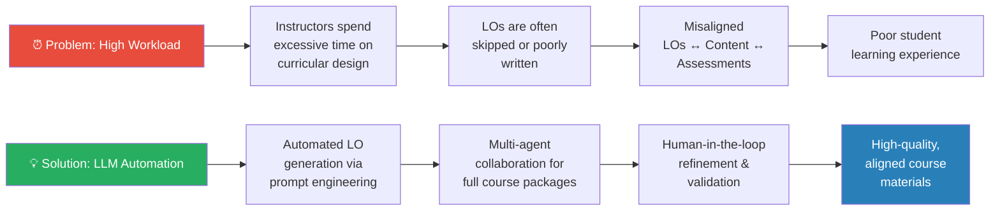

Creating effective Learning Objectives is **challenging and time-consuming**, requiring deep expertise in instructional design. Professors often skip LO authoring in favor of more pressing duties like content creation and teaching. Poor LOs cascade downstream — leading to misaligned content and assessments, ultimately degrading the learning experience.

---

## 🧱 Core Concepts

### Learning Objectives (LOs)

LOs are the **blueprints** against which all course content is designed. A well-constructed LO contains three parts:

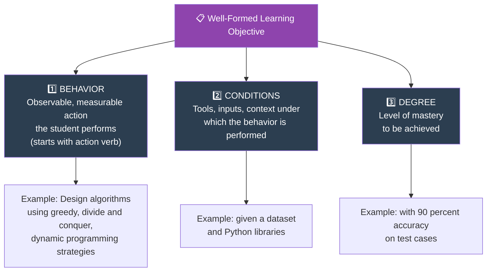

**Example — ADA Course (Course Outcomes):**

| CO1 | CO2 | CO3 | CO4 | CO5 |
|-----|-----|-----|-----|-----|
| Design algorithms using greedy, divide & conquer, dynamic programming | Analyse correctness and complexity of algorithms | Design, analyze, and apply graph algorithms | Implement algorithms for solving problems | Explain NP-hardness, NP-completeness, and reductions |

### Bloom's Taxonomy

LOs target specific cognitive levels according to Bloom's Taxonomy:

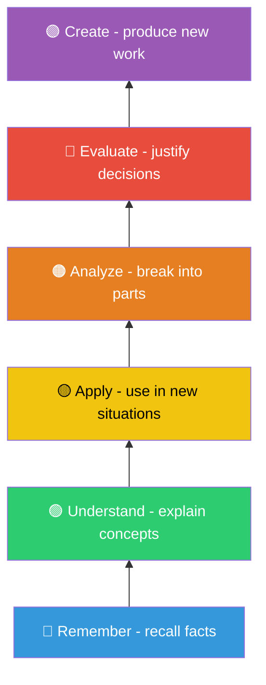

**Conceptual Modules** target the lower levels (Remember, Understand), while **Project Modules** target the higher levels (Apply, Analyze, Evaluate, Create).

### Constructive Alignment

The three pillars of a consistent learning experience must stay aligned:

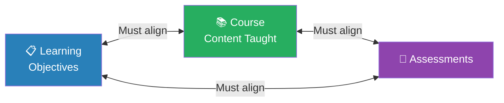

> **When misaligned**, students feel tests don't match lectures, or pass without mastering material.

---

## 📄 Paper 1 — GPT-4 for Authoring Learning Objectives

**Citation:** *Sridhar, P., Doyle, A., Agarwal, A., Bogart, C., Savelka, J., & Sakr, M. (2023). "Harnessing LLMs in Curricular Design: Using GPT-4 to Support Authoring of Learning Objectives." AIED 2023 Workshop.*

### Paper 1 Workflow

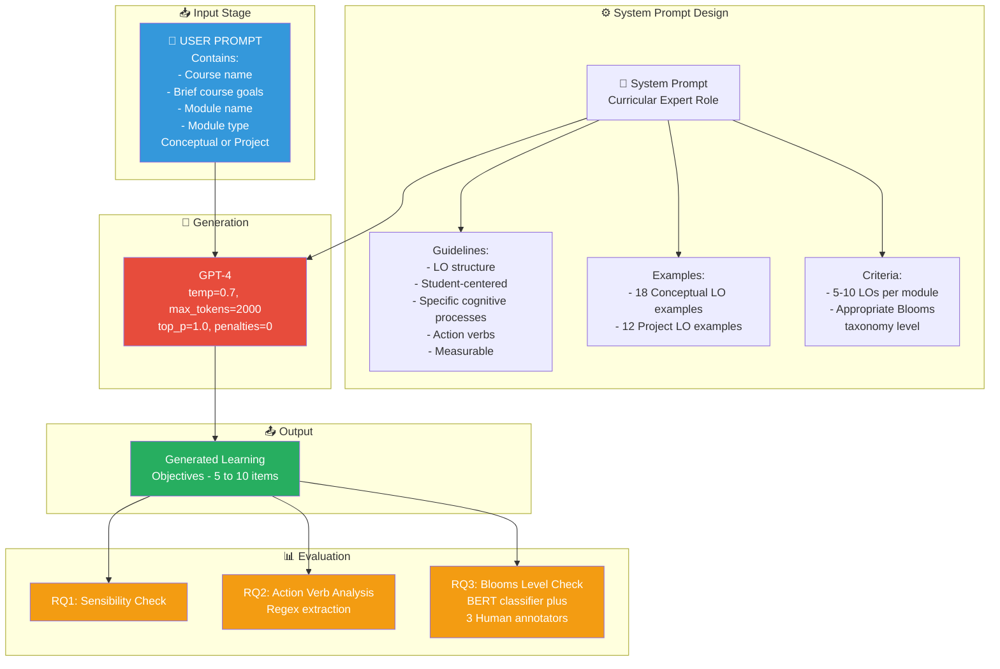

### Prompt Architecture

The approach uses a **two-part prompt** submitted to GPT-4's API:

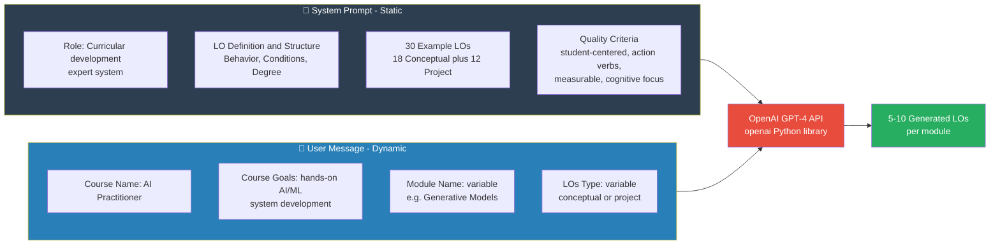

### Research Questions & Results

| RQ | Question | Finding |
|----|----------|---------|
| **RQ1** | Are generated LOs sensible? | ✅ **Largely sensible** — clear, grammatically correct, topic-relevant. Sometimes lack specific focus (e.g., "Python libraries" too broad, should say "scikit-learn"). Better prompting leads to better LOs. |
| **RQ2** | Do LOs start with action verbs? | ✅ **All LOs start with action verbs.** Distribution varies by module type. 26 LOs used verbs not in the provided examples (25 project, 1 conceptual). 11 LOs had multiple action verbs. |
| **RQ3** | Do LOs target appropriate Bloom's levels? | ✅ **Conceptual modules** target lower levels (Remember, Understand). **Project modules** target higher levels (Apply, Analyze, Evaluate, Create). Both BERT classifier and human annotators confirm this (Cohen's kappa = 0.31, inter-method agreement = 0.62). |

**Action Verb Distribution:**

| Module Type | Dominant Verbs | Bloom's Level |
|------------|----------------|---------------|
| **Conceptual** | describe, discuss, explain, identify, define | Remember, Understand |
| **Project** | implement, optimize, develop, utilize, evaluate | Apply, Analyze, Evaluate, Create |

---

## 📄 Paper 2 — Instructional Agents: Multi-Agent Framework

**Citation:** *Yao, H., Xu, W., Turnau, J., Kellam, N., & Wei, H. (2026). "Instructional Agents: Reducing Teaching Faculty Workload through Multi-Agent Instructional Design." Arizona State University.*

### System Architecture

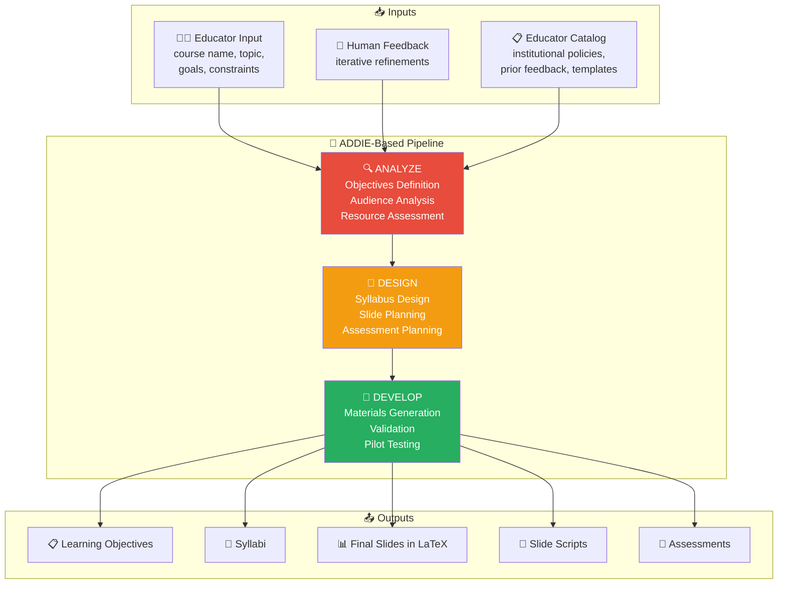

### ADDIE-Based Pipeline

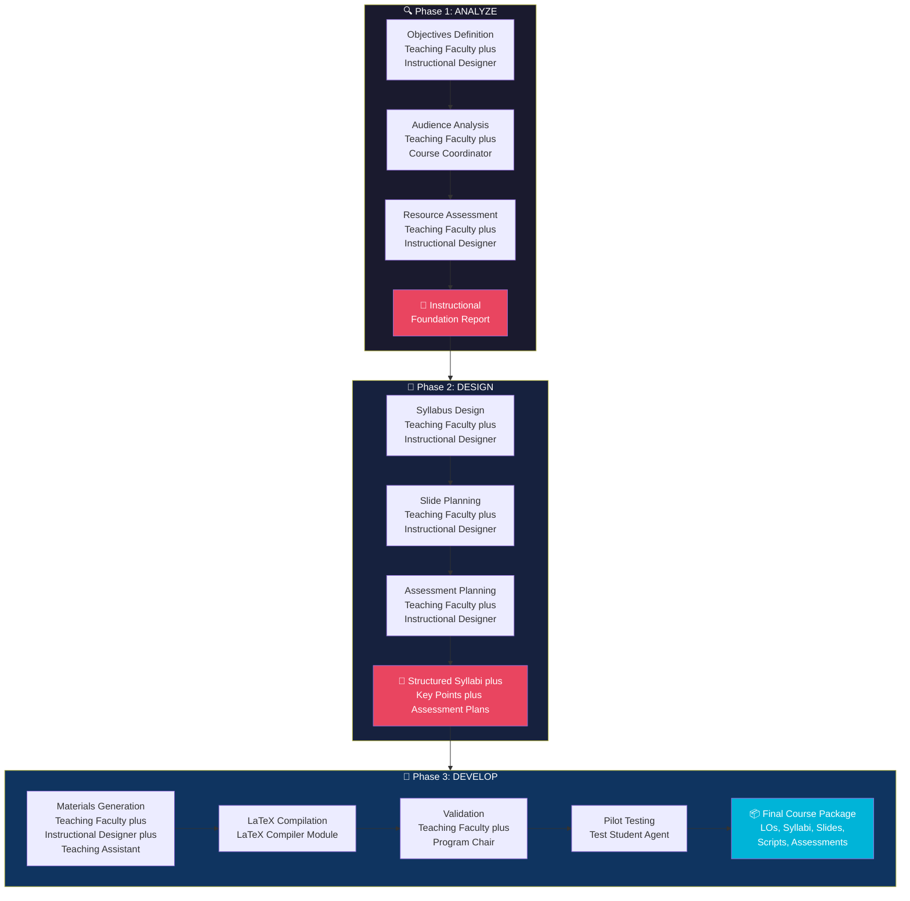

### Agent Roles

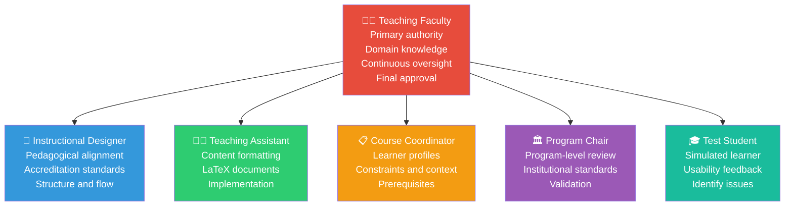

### Operational Modes

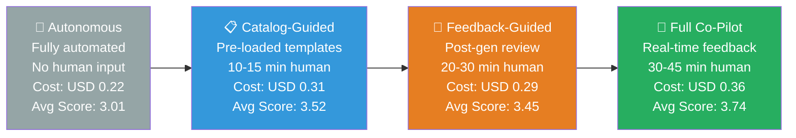

**Mode Details:**

| Mode | Human Effort | Inference Time | Cost (USD) | Quality (Avg) |
|------|-------------|----------------|------------|----------------|
| Autonomous | 0 min | ~2.23 hrs | $0.22 | 3.01 |
| Catalog-Guided | 10-15 min | ~3.73 hrs | $0.31 | 3.52 |
| Feedback-Guided | 20-30 min | ~2.51 hrs | $0.29 | 3.45 |
| Full Co-Pilot | 30-45 min | ~4.73 hrs | $0.36 | **3.74** |

### Evaluation & Results

**Quality Scores (5-point Likert scale, averaged over 5 courses):**

| Mode | LO | Syllabi | Assessments | Slides | Scripts | Package | **Avg** |
|------|----|---------|-------------|--------|---------|---------|---------|
| Autonomous | 3.55 | 2.94 | 2.71 | 2.79 | 3.27 | 2.78 | **3.01** |
| Catalog-Guided | 4.01 | 3.50 | 3.33 | 3.20 | 3.46 | 3.59 | **3.52** |
| Feedback-Guided | 3.78 | 3.31 | 3.24 | 3.32 | 3.58 | 3.50 | **3.45** |
| **Full Co-Pilot** | **4.13** | **3.80** | **3.48** | **3.51** | **3.71** | **3.79** | **3.74** |

**Ablation Study — Role Importance:**

| Configuration | Avg Score | Impact |
|--------------|-----------|--------|
| Single Agent (baseline) | 2.33 | Worst — no role specialization |
| w/o Teaching Faculty | 2.75 | Major drop in syllabi and slides |
| w/o Instructional Designer | 2.80 | Sharp decline in LO and syllabi clarity |
| w/o Teaching Assistant | 2.91 | Moderate drop in formatting |
| Full System (Auto) | 3.01 | Good baseline |
| **Full System (Co-Pilot)** | **3.74** | **Best — all roles plus human feedback** |

---

## 🔄 End-to-End Workflow

The complete pipeline from **instructor input to classroom-ready materials**:

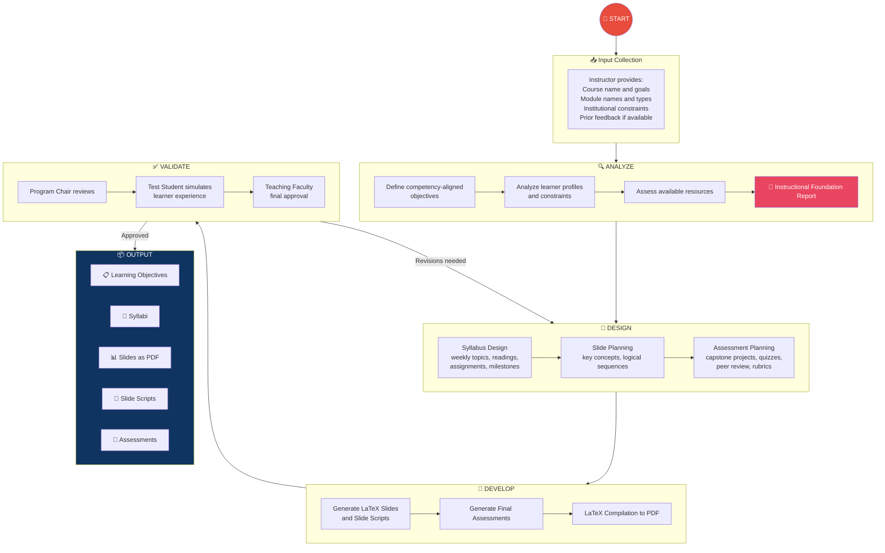

---

## 🔎 Gap Analysis vs. Screenshot Notes

The screenshot notes captured key concepts from Paper 1. Here is what was covered and what was **missing**:

### ✅ Concepts Present in Screenshot

| Concept | Screenshot | Paper |
|---------|-----------|-------|
| Title: "Harnessing LLMs in Curricular Design" | ✅ | ✅ Full title |
| LOs as Blueprints for course design | ✅ | ✅ Section 1 |
| Professor decides LOs | ✅ | ✅ Discussed |
| Consistency between LOs, Content, Assessments | ✅ | ✅ Constructive alignment |
| Structure of well-formed LO (Behavior, Conditions, Degree) | ✅ | ✅ Section 3.2, Figure 2 |
| ADA course example (CO1-CO5) | ✅ | ⚠️ Custom example |
| All LOs start with action verb | ✅ | ✅ RQ2 finding |
| User Prompt → GPT-4 → Output flow | ✅ | ✅ Figure 2 and 3 |
| User Prompt contents (course goals, name, module type) | ✅ | ✅ Figure 3 |
| Module types (Conceptual vs Project) | ✅ | ✅ Core distinction |
| RQ1-RQ3 findings (4 numbered points) | ✅ | ✅ Sections 4.1-4.3 |
| Note on automating LOs (pros and caveats) | ✅ | ✅ Section 5 |

### ❌ Concepts Missing from Screenshot

| Missing Concept | Paper Section | Significance |
|----------------|---------------|--------------|
| **System prompt details** — role definition, quality criteria, example LOs | Section 3.2, Figure 2 | Core prompt engineering approach |
| **User message template** — exact structure with placeholders for module and module_type | Section 3.2, Figure 3 | How prompts are dynamically constructed |
| **GPT-4 hyperparameters** — temperature=0.7, max_tokens=2000, top_p=1, penalties=0 | Section 3.1 | Model configuration |
| **Bloom's Taxonomy full hierarchy** — 6 levels from Remember to Create | Section 1, Background | Theoretical foundation |
| **BERT classifier** — trained on 21,380 LOs from 5,558 courses for automatic classification | Section 3.2 | Automated evaluation methodology |
| **Human annotation details** — 3 annotators, 127 LOs, Cohen's kappa = 0.31, agreement = 0.62 | Section 3.2, 4.3 | Validation methodology |
| **Action verb distribution chart** (Figure 4) — verb frequencies per module type | Section 3.3 | Key quantitative result |
| **LOs with multiple action verbs** — 11 LOs had compound verbs that should be split | Section 4.2 | Quality concern |
| **Novel action verbs** — 13 LOs used verbs not in the prompt at all | Section 4.2 | GPT-4 generalization ability |
| **Specificity issues** — e.g., "Python libraries" too broad | Section 4.1 | Quality limitation |
| **Related work** — IBM Watson approach, MCQ generation, code explanation studies | Section 2 | Academic context |
| **Limitations** — LO errors cascading, LLM skepticism, copyright/ethical concerns | Section 6 | Critical caveats |
| **Future work** — measurability evaluation, comparison with human LOs, assessment generation | Section 7 | Research roadmap |

### ❌ Paper 2 (Instructional Agents) — Entirely Missing from Screenshot

The screenshot only covers Paper 1. The entire Paper 2 content is not represented, including:

- Multi-agent system architecture (5 specialized roles plus Test Student)
- ADDIE framework integration (Analyze, Design, Develop)
- Four operational modes (Autonomous, Catalog-Guided, Feedback-Guided, Co-Pilot)
- Full instructional package generation (slides, scripts, assessments)
- Quantitative evaluation across 5 university courses
- Ablation studies proving role specialization is essential
- Cost/runtime analysis across modes
- LaTeX compilation pipeline
- Pilot testing with simulated student agents

---

## 📊 Key Findings & Takeaways

### From Paper 1 (LO Generation)

1. **GPT-4 can generate sensible LOs** — clear, relevant, and properly structured
2. **Action verbs are appropriate** — conceptual modules use lower Bloom's verbs, projects use higher
3. **Bloom's taxonomy alignment works** — both automated (BERT) and human evaluation confirm proper levels
4. **Better prompts lead to better LOs** — prompt engineering is critical; include examples and structure
5. **Human review remains essential** — LOs sometimes lack specificity or combine multiple objectives

### From Paper 2 (Instructional Agents)

1. **Multi-agent outperforms single agent** — role specialization improves quality across all materials (2.33 to 3.01)
2. **Human-in-the-loop improves quality significantly** — Co-Pilot mode (3.74) vs Autonomous (3.01)
3. **Cost-effective** — gpt-4o-mini matches gpt-4o quality at 1/16th the cost
4. **Each agent role matters** — removing any agent degrades specific output types
5. **LLM evaluators are unreliable** — they give mediocre, tightly clustered scores vs. human evaluators' broader range

### Combined Insight

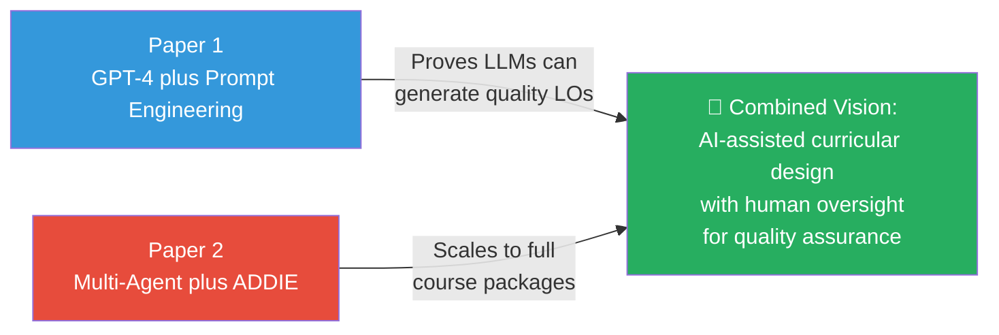

---

## ⚠️ Limitations & Caveats

> **CAUTION: LOs drive the entire course development pipeline.** Errors in LOs cascade and snowball into low-quality course content, assessments, and learning experiences.

| Limitation | Details |
|-----------|---------|
| **Over-reliance risk** | May reduce pedagogical creativity and produce generic LOs |
| **Specificity gaps** | LLMs sometimes use overly broad terms (e.g., "Python libraries" instead of "scikit-learn") |
| **Multiple action verbs** | Some LOs combine 2+ objectives that should be separate |
| **ADDIE coverage** | Only Analyze, Design, Develop phases — Implementation and Evaluation need real classroom deployment |
| **Visual content** | Limited support for rich visual and interactive instructional elements |
| **Bias concerns** | LLM-generated content may introduce subtle biases requiring human review |
| **Ethical concerns** | Training on copyrighted materials raises institutional policy questions |
| **Professor review mandatory** | Generated content is a **draft** — faculty must examine, refine, and approve all materials |

> **IMPORTANT: The professor must always examine and improve the LOs created.** These tools are designed to *support*, not *replace*, educator expertise.

---

## 📚 References

1. **Paper 1:** Sridhar, P., Doyle, A., Agarwal, A., Bogart, C., Savelka, J., & Sakr, M. (2023). *Harnessing LLMs in Curricular Design: Using GPT-4 to Support Authoring of Learning Objectives.* Workshop on Empowering Education with LLMs, AIED 2023. [arXiv:2306.17459](https://arxiv.org/abs/2306.17459)

2. **Paper 2:** Yao, H., Xu, W., Turnau, J., Kellam, N., & Wei, H. (2026). *Instructional Agents: Reducing Teaching Faculty Workload through Multi-Agent Instructional Design.* Arizona State University. [arXiv:2508.19611](https://arxiv.org/abs/2508.19611) | [Project Website](https://darl-genai.github.io/instructional_agents_homepage/)

3. Bloom, B. S. et al. (1956). *Taxonomy of Educational Objectives: Handbook I — Cognitive Domain.*

4. Krathwohl, D. R. (2002). *A Revision of Bloom's Taxonomy: An Overview.* Theory into Practice, 41, 212–218.

5. Tran, K. N. et al. (2018). *Document Chunking and Learning Objective Generation for Instruction Design.* EDM 2018.

6. Gagne, R. M. et al. (2005). *Principles of Instructional Design.*

7. Branch, R. M. & Varank, I. (2009). *Instructional Design: The ADDIE Approach.*

8. Quality Matters. (2023). *Higher Education Rubric, Seventh Edition.*

---

**Built as a research synthesis for AI-assisted curricular design.**

*"Automation should support, not replace, the educator's expertise."*

